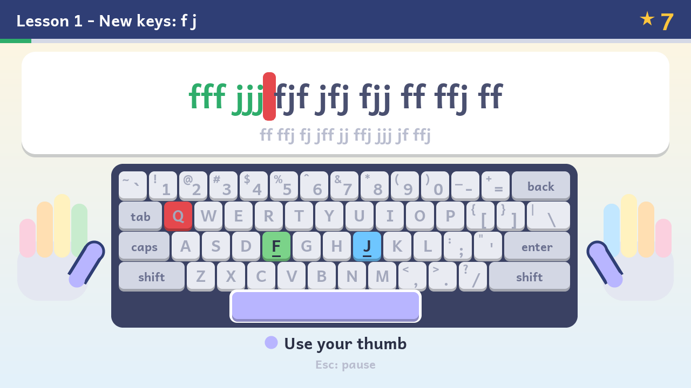
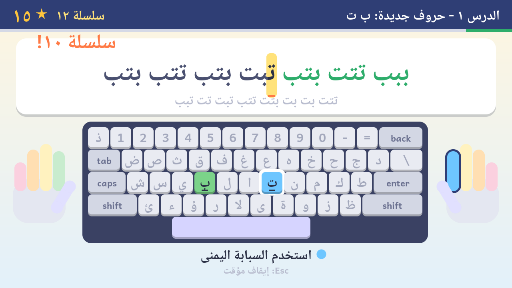
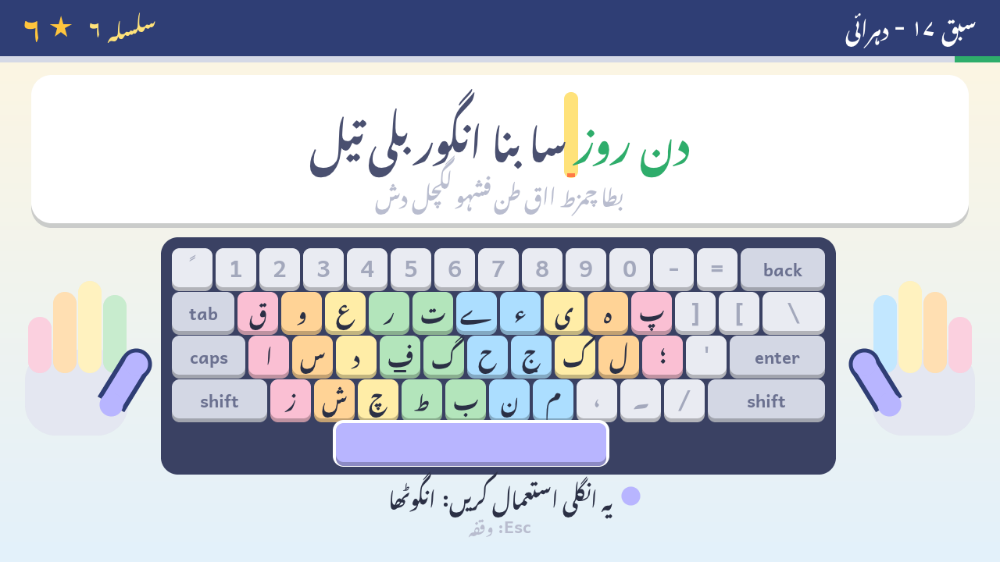
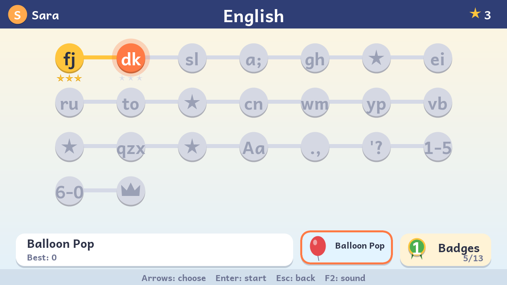
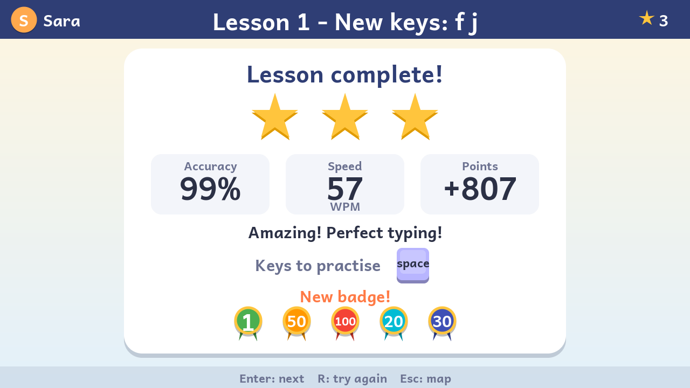
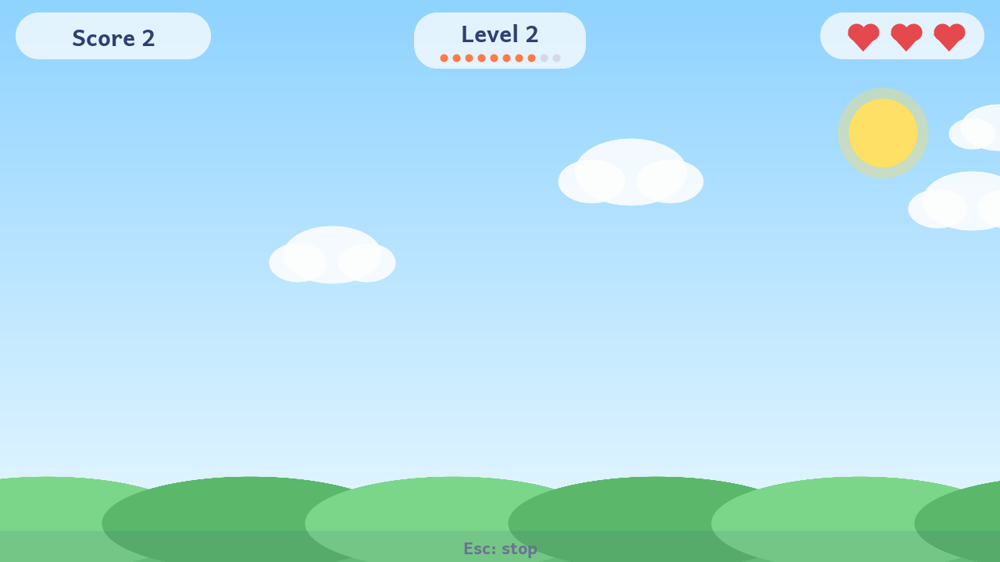

# Typing Adventure · مغامرة الكتابة · ٹائپنگ کی مہم

A touch-typing tutor for children, in **English, Arabic and Urdu**, that runs directly
on a **Raspberry Pi 3 B+** with **no operating system**. The SD card holds the
Pi's boot firmware, two small text files and one program. That program
drives the screen, keyboard, SD card and sound itself.



| Arabic lesson | Urdu lesson (Nastaliq) | Lesson map | Results |
|---|---|---|---|
|  |  |  |  |

## What is on the SD card

| File | What it is |
|---|---|
| `kernel8.img` | This program (about 3 MB, mostly fonts) |
| `bootcode.bin`, `start.elf`, `fixup.dat` | Raspberry Pi GPU boot firmware (closed source, required by every Pi) |
| `LICENCE.broadcom` | Licence for the firmware files |
| `config.txt`, `cmdline.txt` | Boot settings |
| `progress.txt` | Created on first use: players and their progress (plain text) |

That's everything. There is no Linux, no shell, no drivers beyond the ones
listed below, and no device-tree or overlay files.

## Security model

The goal is a machine that can only ever be a typing tutor.

- **No operating system.** The program is built with
  [Circle](https://github.com/rsta2/circle), a C++ library for bare-metal
  Raspberry Pi programs. Only the parts it uses are linked in: the HDMI
  framebuffer, the USB host controller, the USB keyboard driver, the SD-card
  controller with a FAT filesystem, and HDMI/headphone sound.
- **No networking code at all.** No TCP/IP stack, no Ethernet driver, no
  Wi-Fi or Bluetooth driver. The built kernel was checked for these symbols;
  none are present.
- **Wi-Fi and Bluetooth stay unused.** The Pi's wireless chip has no firmware of
  its own. An operating system has to upload firmware into it before it can do
  anything, and nothing on this card does that. The on-board Ethernet is a USB
  device with no driver here, so it is ignored.
- **Only keyboards are accepted over USB.** Every other USB driver class is
  compiled out: storage, mouse, gamepad, audio, MIDI, serial, printer,
  touchscreen, network, Bluetooth. A USB stick plugged in does nothing. A device
  pretending to be a keyboard could only type into the tutor.
- **No console.** There is no serial output and no debug shell. Log messages
  stay in memory. They appear on screen only if no keyboard is found or the
  program stops on an error.
- **Pinned, checksummed inputs.** The build checks the SHA-256 of the
  compiler download and of the GPU firmware (`firmware/SHA256SUMS`, taken
  from the Raspberry Pi firmware revision that Circle is tested with).
- **Third-party code is pinned and sees no outside input.** To draw Urdu,
  the kernel includes [HarfBuzz](https://github.com/harfbuzz/harfbuzz) (text
  shaping) and [stb_truetype](https://github.com/nothings/stb) (glyph
  rasteriser), both git submodules pinned to a fixed commit. HarfBuzz is
  built with only its OpenType shaper (no files, threads or environment
  variables). Both only ever read the one font built into the kernel.

Limits worth knowing:

- The GPU firmware (`bootcode.bin`, `start.elf`) is closed source and runs
  before this program. Every Raspberry Pi needs it.
- If the Pi 3 B+ cannot boot from the SD card, its boot ROM can try USB and
  network boot instead. With this card inserted it always boots from the
  card.
- Anyone with physical access can swap the SD card. Physical security is up to
  you.

## Using it

Ready-made downloads are on the repository's **Releases** page. Pushing a
version tag (`git tag v1.0 && git push origin v1.0`) builds, tests and
publishes a release named after the tag (`.github/workflows/release.yml`). Each release includes a flashable image,
the card files, a `kernel8.img` for updating an existing card, and install
instructions (from `docs/release-notes.md`).

To build it yourself:

1. Flash `build/typing-adventure.img` to an SD card, using
   [Raspberry Pi Imager](https://www.raspberrypi.com/software/) ("Use custom")
   or `dd`. Alternatively, copy the files from `build/sdcard/` onto a card
   formatted as FAT32.
2. Put the card in a Pi 3 B+, connect an HDMI screen and a USB keyboard, and
   power on.
3. Choose **New player**, type a name (**Tab** switches between English,
   Arabic and Urdu letters), and pick a colour with **Left/Right**.
4. Choose the **English**, **العربية** or **اردو** course and start lesson 1.

Keys: **arrows** move, **Enter** chooses, **Esc** goes back or pauses a lesson,
**F2** turns sound on or off. On the players screen, **Delete** removes a
player (after confirming with **Y**). **F12** opens the system log from any
screen (arrow keys, PgUp/PgDn, Home and End scroll it), for checking hardware.

Several keyboards can be plugged in at once (for example a wired keyboard and
a wireless receiver), and all of them work.

Up to 8 players can keep separate progress. Progress is saved to the SD card
after every lesson and game. Saving is crash-safe: the new file is written
first and the previous one kept as `progress.txt.bak`. If the card can't be
written, the players screen shows a warning.

**Sound** goes to the headphone jack (`sounddev=sndpwm` in `cmdline.txt`).
For HDMI speakers use `sounddev=sndhdmi`; for silence, `sounddev=none`. Keep
everything in `cmdline.txt` on one line.

**USB** runs at full speed (`usbspeed=full` in `cmdline.txt`). Keyboards
don't need more. Without it, keyboards behind the Pi 3 B+'s built-in hub may
not be recognised. If a keyboard still isn't found after about 6 seconds,
the screen shows a USB diagnostic log.

**Keyboard layout.** The program reads raw key positions and applies the US
English layout, the standard Arabic (101) layout or the Urdu phonetic
layout (CRULP, the same as `pk(urd-phonetic)` on Linux) itself. A bilingual
keyboard with Arabic letters printed on the keys matches the on-screen
keyboard exactly. The Urdu phonetic layout puts each letter on the English
key that sounds alike (ا on A, ب on B, پ on P), so an ordinary English
keyboard works for Urdu.

## How the course teaches

All three courses follow the classic touch-typing progression:

1. **Home row first**, starting from the index-finger anchor keys with the
   bumps: **F J** in English, **ب ت** in Arabic, **ف ج** in Urdu. Then one
   finger pair at a time out to the little fingers.
2. **Top row, then bottom row**, two keys at a time by finger. The most frequent
   letters come first, so real words are available early.
3. A **review lesson** after each group, then **Shift** (English capitals,
   Arabic أ إ آ, or the Urdu Shift letters such as ٹ ڈ ڑ ں ھ), **punctuation**,
   **numbers** (English and Arabic only for now), and a **final challenge** of
   whole sentences.

Every new-key lesson moves from drills of the new keys (`fff jjj fjf`), to
groups mixed with keys already learned, to **real words that use only letters
already taught**. Arabic and Urdu words and sentences are spelled correctly.
Words that need a hamza form only appear after the hamza lesson, and full
stops appear only after the punctuation lesson.

During a lesson:

- The on-screen keyboard highlights the **next key** in the colour of the
  **finger** that should press it, and coloured hands show which finger.
- Mistakes aren't erased with Backspace: the child presses the right key to
  continue. This keeps **accuracy first**.
- Capitals give a gentle tip if the child uses Shift on the same hand as the
  letter; touch typing uses the opposite hand.
- Caps Lock being on is pointed out.

A lesson counts as passed at **90% accuracy** (1 star). **95%** earns 2 stars.
**98%** plus the lesson's target speed (8–18 words per minute) earns 3 stars.
The results screen lists the keys that caused the most mistakes.

**Game features:** stars, points, combo streaks with celebrations, 13 badges,
player ranks (Seedling to Grand Master), and **Balloon Pop**, a game that uses
only the keys learned so far, with letters or words.

In Balloon Pop, every 10 balloons popped clears a level, and each level is
faster than the last. The score is **levels cleared × letters in play**
(doubled in words mode). A child who has learned more letters therefore
scores more than one playing only F and J. Each set of letters keeps its own
best level. **Up/Down** on the game's start screen picks the starting level,
up to one past the best level cleared with those letters. Skipped levels
count as cleared. The game also shows the player's best score and the top
score of all players in that course, with the record holder's name.



## Building

Requirements on a Linux PC: `make`, `git`, `curl`, `python3` with Pillow and
fontTools, and `sfdisk`, `mkfs.vfat` and `mtools` to build the card image. The
ARM compiler (Arm GNU Toolchain 15.2) is downloaded into `tools/`
automatically, and its checksum is verified.

```sh
git submodule update --init
make          # builds build/typing-adventure.img and build/sdcard/
make test     # desktop simulator tests; screenshots in build/shots/
make qemu     # a variant for QEMU (raspi3b); see scripts/qemu-run.sh
```

### Layout

```
src/core/      the tutor itself: screens, curriculum, text, graphics (no OS or hardware code)
src/pi/        the bare-metal kernel: display, USB keyboard, SD card, sound (Circle)
src/sim/       desktop simulator: scripted key presses, PNG screenshots
scripts/       font pre-rendering, QEMU helpers
tests/sim/     simulator test scripts
patches/       changes to Circle (circle-fix-*: every build; circle-debug-*: make debug only)
boot/          config.txt and cmdline.txt for the card
firmware/      checksums of the Raspberry Pi boot firmware
assets/fonts/  Andika (Latin, designed for early readers), Noto Naskh Arabic, Noto Nastaliq Urdu
external/      git submodules, kept unmodified: Circle (release Step51.1),
               HarfBuzz (14.5.0) and stb (stb_truetype)
```

The build never changes `external/circle`. Each variant (Pi, QEMU, debug)
builds its own copy with the patches applied. The one fix so far keeps a
USB device that has no driver (such as the Pi's own Ethernet chip) enumerated
and unused, instead of dropping it. Dropping it freed its USB address while
the device still answered there, so a keyboard plugged in later could get the
same address and neither would work.

The Latin and Arabic fonts are pre-rendered to anti-aliased bitmaps when you
build (`scripts/gen_fonts.py`). Arabic letter joining, the lam-alef ligature
and right-to-left layout are handled in `src/core/text.cpp`.

Urdu is written in **Nastaliq**, where letters sit on a sloping baseline and
change shape and position with their neighbours. That can't be pre-rendered
letter by letter, so the Noto Nastaliq Urdu font is built into the kernel as
is. `src/core/nastaliq.cpp` shapes Urdu text with HarfBuzz and rasterises the
glyphs with stb_truetype when they are first needed. Both results are cached:
a new string takes about 0.15 ms on a desktop PC (so roughly 1–3 ms on the
Pi) the first time it appears, and nothing after that.

## Licences

- Circle is GPL-3.0, so the built `kernel8.img` is GPL-3.0 as a combined work.
- Andika, Noto Naskh Arabic and Noto Nastaliq Urdu are under the SIL Open
  Font License 1.1 (`assets/fonts/`).
- HarfBuzz is under the MIT ("Old MIT") licence; stb_truetype is public
  domain (or MIT).
- The Raspberry Pi firmware is under Broadcom's redistribution licence
  (`LICENCE.broadcom`).
